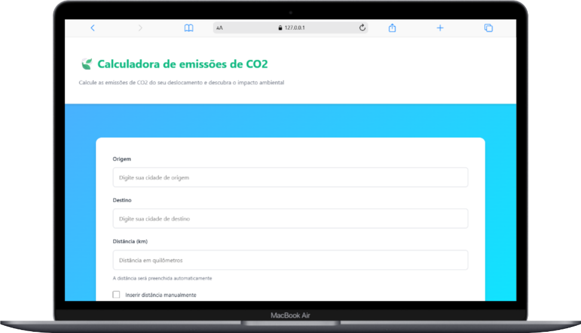
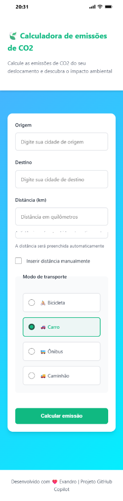

# 🌍 Calculadora de Emissões de CO₂

Uma aplicação web moderna e responsiva para calcular as emissões de dióxido de carbono (CO₂) geradas por diferentes modos de transporte, com comparações detalhadas e sugestões de compensação ambiental.

## 🎯 Objetivo

Conscientizar os usuários sobre o impacto ambiental de suas escolhas de transporte, permitindo que visualizem claramente as emissões de CO₂ para diferentes modos de locomoção e compreendam alternativas mais sustentáveis.

## ✨ Funcionalidades Principais

### 1️⃣ Cálculo de Emissões
- **Busca automática de distância**: A aplicação identifica rotas pré-cadastradas entre cidades brasileiras e preenche automaticamente a distância
- **Modo de transporte flexível**: Selecione entre bicicleta, carro, ônibus ou caminhão
- **Inserção manual de distância**: Opção de informar a distância manualmente quando não encontrada na base de dados

### 2️⃣ Comparação Interativa
- **Visualização de todos os modos**: Veja a emissão de CO₂ para todos os modos de transporte em uma única rota
- **Barras de progresso color-coded**: 
  - 🟢 Verde (0-25%): Baixa emissão
  - 🟡 Amarelo (25-75%): Emissão média
  - 🟠 Laranja (75-100%): Alta emissão
  - 🔴 Vermelho (>100%): Muito alta emissão
- **Percentual vs Carro**: Compara automaticamente com o carro como baseline

### 3️⃣ Cálculo de Créditos de Carbono
- **Quantidade de créditos necessários**: Calcula quantos créditos de carbono (1 crédito = 1.000 kg CO₂) seriam necessários para compensar a emissão
- **Estimativa de preço**: Fornece range de preço em reais (R$ 50-150 por crédito) com valor médio

### 4️⃣ Interface Moderna e Responsiva
- **Design elegante**: Paleta de cores eco-friendly com degradado de fundo
- **Totalmente responsivo**: Funciona perfeitamente em desktop, tablet e mobile
- **Animações suaves**: Transições e efeitos visuais polidos
- **UX intuitiva**: Formulário claro com validação de entrada

## 📊 Especificações Técnicas

### Stack Tecnológico
- **HTML5 Semântico**: Estrutura limpa e acessível
- **CSS3 Moderno**: Grid, Flexbox, Custom Properties, Animações
- **JavaScript Vanilla**: Sem dependências externas
- **BEM Naming Convention**: Classes bem organizadas e reutilizáveis

### Base de Dados de Rotas
- **35+ rotas brasileiras pré-cadastradas**
- Inclui rotas entre capitais e trajetos regionais
- Cobertura das 5 regiões do Brasil

### Fatores de Emissão de CO₂ (kg por km)
| Modo de Transporte | Emissão CO₂ |
|-------------------|------------|
| 🚲 Bicicleta | 0 kg/km |
| 🚌 Ônibus | 0,089 kg/km |
| 🚗 Carro | 0,12 kg/km |
| 🚚 Caminhão | 0,96 kg/km |

### Configurações de Créditos de Carbono
- **1 crédito = 1.000 kg CO₂**
- **Preço range: R$ 50 - R$ 150 por crédito**

## 🏗️ Estrutura do Projeto

```
carbon-calc/
├── index.html              # Estrutura HTML5 semântica
├── css/
│   └── style.css           # Estilos completos com CSS Variables
├── js/
│   ├── routes-data.js      # Base de dados de rotas brasileiras
│   ├── config.js           # Configurações globais e inicialização
│   ├── calculator.js       # Lógica de cálculos de emissão
│   ├── ui.js               # Renderização dinâmica de UI
│   └── app.js              # Aplicação principal e event handling
├── images/
│   ├── mackbook.png        # Preview em MacBook
│   └── mobile.png          # Preview em Mobile
└── README.md               # Este arquivo
```

## 📱 Visualização

### Desktop (MacBook)


### Mobile


## 🚀 Como Usar

1. **Abra a aplicação** no seu navegador (index.html)
2. **Selecione a cidade de origem** - Use o autocomplete com as cidades disponíveis
3. **Selecione a cidade de destino** - A distância será preenchida automaticamente se a rota existir
4. **Escolha o modo de transporte** - Selecione entre as 4 opções disponíveis
5. **Clique em "Calcular emissão"** - Aguarde o processamento
6. **Visualize os resultados**:
   - Emissão em kg de CO₂
   - Comparação com outros modos de transporte
   - Créditos de carbono necessários
   - Estimativa de preço para compensação

## 💻 Arquivos do Projeto

### `index.html`
- Estrutura HTML5 semântica completa
- Formulário com campos para origem, destino e distância
- Seletor de modo de transporte em grid visual
- Seções para exibição de resultados (inicialmente ocultas)

### `css/style.css`
- **CSS Variables** para cores eco-friendly, espaçamento e sombras
- **Componentes**: Header, Form, Button, Cards
- **Responsividade**: Media queries para mobile e desktop
- **Animações**: Fade-in para seções de resultados
- **BEM Convention**: Nomes de classes bem organizados

### `js/routes-data.js`
- Objeto `RoutesDB` com 35+ rotas brasileiras
- Método `getAllCities()`: Retorna lista única de cidades
- Método `findDistance()`: Busca distância em ambas as direções

### `js/config.js`
- Objeto `CONFIG` com configurações globais
- `EMISSION_FACTORS`: Fatores de emissão por modo
- `TRANSPORT_MODES`: Metadados (label, ícone, cor)
- `CARBON_CREDIT`: Configurações de créditos
- Método `populateDatalist()`: Popula autocomplete
- Método `setupDistanceAutofill()`: Ativa preenchimento automático

### `js/calculator.js`
- Objeto `Calculator` com métodos de cálculo
- `calculateEmission()`: Emissão para um modo
- `calculateAllModes()`: Emissões comparativas
- `calculateSavings()`: Economia comparada ao carro
- `calculateCarbonCredits()`: Créditos necessários
- `estimateCreditPrice()`: Estimativa de preço

### `js/ui.js`
- Objeto `UI` com métodos de interface
- `formatNumber()` e `formatCurrency()`: Formatação de valores
- `showElement()` e `hideElement()`: Controle de visibilidade
- `scrollToElement()`: Scroll suave
- `showLoading()` e `hideLoading()`: Estado de carregamento
- `renderResults()`: HTML de resultados
- `renderComparison()`: HTML de comparação
- `renderCarbonCredits()`: HTML de créditos

### `js/app.js`
- Inicialização da aplicação no `DOMContentLoaded`
- `handleFormSubmit()`: Manipulador do envio do formulário
- `processCalculation()`: Lógica de processamento com simulação de delay
- Validação completa de inputs
- Tratamento robusto de erros

## 🎨 Paleta de Cores (Eco-friendly)

| Cor | Hex | Uso |
|-----|-----|-----|
| Verde Primário | #10b981 | Botões, destaques, sucesso |
| Verde Secundário | #059669 | Hover, ênfase |
| Verde Acento | #34d399 | Highlights |
| Vermelho (Perigo) | #ef4444 | Alertas, erros |
| Amarelo (Aviso) | #159e0b | Warnings |
| Azul (Info) | #3b8216 | Informações |

## 🔧 Requisitos do Navegador

- HTML5 support
- CSS3 Grid e Flexbox
- JavaScript ES6+
- Suporta todos os navegadores modernos:
  - ✅ Chrome/Edge 60+
  - ✅ Firefox 55+
  - ✅ Safari 12+
  - ✅ Mobile browsers

## 📈 Futuras Melhorias

- [ ] Integração com API de geocoding para mais cidades
- [ ] Histórico de cálculos salvos localmente
- [ ] Gráficos de emissão ao longo do tempo
- [ ] Integração com serviços de compensação de carbono
- [ ] Modo dark/light
- [ ] Múltiplos idiomas
- [ ] Exportação de relatórios em PDF

## 👨‍💻 Desenvolvedor

**Evandro Santos** | [GitHub: @vandersant7](https://github.com/vandersant7) | Projeto GitHub Copilot

---

<div align="center">

### Desenvolvido com ❤️ para um planeta mais sustentável 🌍

**Reduzir emissões de CO₂ começa com escolhas conscientes**

[](https://github.com/vandersant7)

</div>
